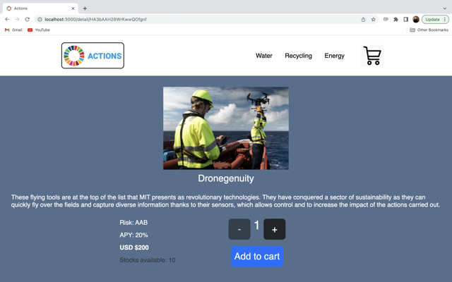

ACTIONS

Concept:

Actions is a platform that allows all users to invest in a sustainable futere by buying stocks from a wide catalog of sustainable companies.

This fast Single Page Application was developed by Joaquin Francisco Martin Lanfranchi using React.js.

Development tools:

Create React App React Router Firestore Bootstrap v5.

Functionality:

This application consumes a collection of projects stored in Firestore, in which the user will be able to choose what and how many stocks from that company to add to their shopping cart and then finalize their order with their personal data (hardcoded for now).
This order is stored in Firestore, providing the user with its tracking number.

Interface:

Installstion:

Descargar Zip
npm install
npm start

Copyright (c) [2022] [Joaquin Francisco Martin Lanfranchi]

Permission is hereby granted, free of charge, to any person obtaining a copy of this software and associated documentation files (the "Software"), to deal in the Software without restriction, including without limitation the rights to use, copy, modify, merge, publish, distribute, sublicense, and/or sell copies of the Software, and to permit persons to whom the Software is furnished to do so, subject to the following conditions:

The above copyright notice and this permission notice shall be included in all copies or substantial portions of the Software.

THE SOFTWARE IS PROVIDED "AS IS", WITHOUT WARRANTY OF ANY KIND, EXPRESS OR IMPLIED, INCLUDING BUT NOT LIMITED TO THE WARRANTIES OF MERCHANTABILITY, FITNESS FOR A PARTICULAR PURPOSE AND NONINFRINGEMENT. IN NO EVENT SHALL THE AUTHORS OR COPYRIGHT HOLDERS BE LIABLE FOR ANY CLAIM, DAMAGES OR OTHER LIABILITY, WHETHER IN AN ACTION OF CONTRACT, TORT OR OTHERWISE, ARISING FROM, OUT OF OR IN CONNECTION WITH THE SOFTWARE OR THE USE OR OTHER DEALINGS IN THE SOFTWARE.